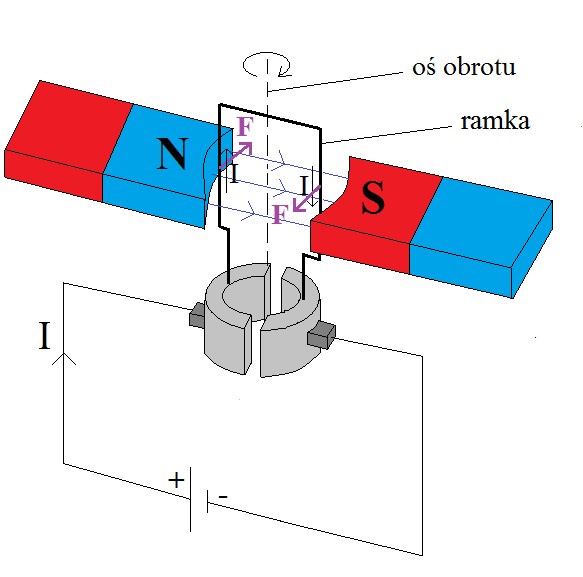

#fizyka

Na naładowaną cząstkę poruszającą się w polu magnetycznym ale nie wzdłuż linii pola działa siła magnetyczna. Jest ona prostopadła do linii pola i do kierunku ruchu cząstki.

Siła magnetyczna działa także na elektrony płynące w przewodzie w polu mangetycznym, a za ich pośrednictwem na cały przewód. To zjawisko jest podstawą silnika elektrycznego.

Siła działająca na cząstki wiatru słonecznego w polu magnetycznym Ziemii chroni nas przed nadmiernym działaniem tego zjawiska i powoduje powstawanie zorzy polarnej.

## Reguła lewej dłoni

Siła jest prostopadła do linii pola oraz do kierunku ruchu cząstki
s. 154 podręcznik.

## Zasada działania silnika elektrycznego

Ramka prewodzi prąd, więc działa na nią siła. 
s. 154 podręcznik.
